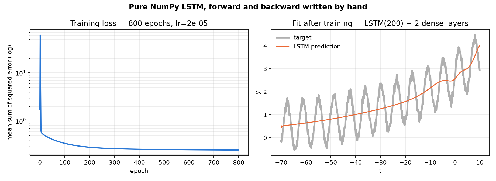

# LSTM from scratch

An LSTM implemented in **pure NumPy** — forward pass and backpropagation through
time both written by hand from the equations. No PyTorch, no TensorFlow, no
autograd. Every gradient in this repository was derived on paper first.



The task is a toy on purpose: predict `y = sin(t) + noise + exp((0.5t + 20)·0.05)`
over 800 timesteps. The point is the backward pass, not the benchmark.

## The part that is actually hard

Forward is bookkeeping. The interesting code is the gradient that flows backwards
through time — the hidden state at step `t` influences every later step, so
`dh_t` accumulates the contribution of all four gates plus the gradient arriving
from the layer above:

```python
for t in reversed(range(T)):
    Tanh2[t].backward(dht)
    dtanh2 = Tanh2[t].dinputs

    # dh_t/dc_t, then split it across the three paths into c_t
    dhtdtanh     = np.multiply(O[t], dtanh2)
    dctdft       = np.multiply(dhtdtanh, C[t-1])       # via the forget gate
    dctdit       = np.multiply(dhtdtanh, C_tilde[t])   # via the input gate
    dctdct_tilde = np.multiply(dhtdtanh, I[t])         # via the candidate
    ...
    # the recurrent term: four gate paths plus the upstream gradient
    dht = np.dot(self.Wf, dsigmf) + np.dot(self.Wi, dsigmi) + \
          np.dot(self.Wo, dsigmo) + np.dot(self.Wg, dtanh1) + \
          dvalues[t-1, :].reshape(self.n_neurons, 1)
```

`LSTMcell.py` is the whole model: `LSTM.forward` runs the recurrence,
`LSTM.backward` accumulates `dU`, `dW` and `db` for the forget, input, output and
candidate gates, and `Layer_Dense` is a hand-written dense layer with its own
forward and backward. `utils.py` holds `TanH` and `Sigmoid` with their
derivatives (`1 - tanh²`, `σ(1-σ)`).

## Run it

```bash
pip install -r requirements.txt
python Dataset.py
```

That trains for 800 epochs and writes `assets/loss_curve.png`. Override with
environment variables: `EPOCHS=100 LR=1e-5 python Dataset.py`.

## What it learns, and what it does not

Loss falls from 1.77 to about 0.32 and then flattens. The model tracks the
exponential trend cleanly and **never learns the sine oscillation** — visible in
the right-hand panel above.

That is a property of the setup, not a mystery: the input is raw `t` in
`[-70, 10]` fed unnormalised into `tanh` and `σ`, which saturates the gates, and
the optimiser is plain SGD with a fixed learning rate and no gradient clipping.
At `lr = 5e-5` the loss diverges to `NaN` within a few epochs. Normalising the
input and adding momentum would be the first things to try.

## Companion

The Transformer, built the same way, lives in
[Transformer-From-Stones](https://github.com/mohamedAtoui/Transformer-From-Stones).

## Fixed along the way

Three bugs that were live in the original commit, kept here because they are the
kind worth recognising:

1. **The output gate used the forget gate's weights.** `outo` was computed from
   `Uf`, `Wf`, `bf`, so `Uo`, `Wo` and `bo` were never used in the forward pass —
   even though `backward` dutifully computed gradients for them.
2. **Gradient accumulators were seeded with noise.** They were initialised to
   `0.1 * np.random.rand(...)` on every forward pass, so each backward pass
   accumulated on top of a random positive offset instead of zero.
3. **The dense biases decayed instead of learning.**
   `dense1.biases -= lr * dense1.biases` should have read `dense1.dbiases`.

Also: `float()` on a 1×1 array was removed in NumPy 2, so the loss line now uses
`.item()` and the script runs on current NumPy.
